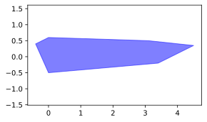
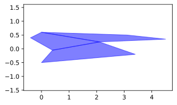

# ZonoOpt
This C++ library provides classes and tailored optimization routines for zonotopes, constrained zonotopes, and hybrid zonotopes. 


## Zonotopes, Constrained Zonotopes, and Hybrid Zonotopes
Zonotopes and their generalizations are set representations widely used for reachability analysis. 
A major advantage of these set representations when compared to alternatives such as halfspace representation (H-rep) 
or vertex representation (V-rep) polytopes is that they have efficient identities for many important set operations.
This makes them well-suited to contexts where efficient online set computations are required, such as online safety verification
and set-valued state estimation.


This library focuses specifically on zonotopes, constrained zonotopes, and hybrid zonotopes. 
A set $\mathcal{Z}$ is a zonotope if there exist a generator matrix $G$ and center vector $c$ such that

$$ \mathcal{Z} = \left\lbrace G \xi + c \\; : \\; \xi \in [-1, 1]^{n_G} \right\rbrace \\;. $$

Zonotopes represent centrally symmetric, convex polytopes.


A set $\mathcal{Z}_C$ is a constrained zonotope if there additionally exist a constraint matrix $A$ and constraint vector $b$ such that

$$ 
\mathcal{Z}_C = 
\left\lbrace 
G \xi + c \\; : \\; \xi \in [-1, 1]^{n_G}, A \xi = b 
\right\rbrace \\;. 
$$

Constrained zonotopes represent convex polytopes.



Hybrid zonotopes extend constrained zonotopes by allowing for a subset of the factors $\xi$ to be binary-valued, i.e.,
$\xi = [\xi_c \quad \xi_b]^T$ where $\xi_c \in [-1, 1]^{n_{Gc}}$ and $\xi_b \in \lbrace -1, 1 \rbrace^{n_{Gb}}$.
A set $\mathcal{Z}_H$ is then a hybrid zonotope if there exist generator matrices $G_c$ and $G_b$, center $c$, 
and constraint matrices $A_c$ and $A_b$, and constraint vector $b$ such that

$$ \mathcal{Z}_H = \left\lbrace
    \begin{bmatrix} G_c & G_b \end{bmatrix} \begin{bmatrix} \xi_c \\\\ \xi_b \end{bmatrix} + c 
    \\; : \\;
    \begin{matrix} 
    \xi_c \in [-1, 1]^{n_{Gc}},\\; \xi_b \in \lbrace -1, 1 \rbrace^{n_{Gb}}, \\\\
    \begin{bmatrix} A_c & A_b \end{bmatrix} \begin{bmatrix} \xi_c \\\\ \xi_b \end{bmatrix} = b
    \end{matrix}
    \right\rbrace \\;. $$

Hybrid zonotopes represent unions of non-convex polytopes.



## ZonoOpt Features
The ZonoOpt library provides classes and set operations for zonotopes, constrained zonotopes, and hybrid zonotopes.
For cases where numerical optimization is required, e.g., checking if a set is empty or solving an MPC problem where the 
constraints are represented as a zonotopic set, custom optimization routines are utilized. 
Some key features of the ZonoOpt library are as follows:
- All classes and methods are implemented using sparse linear algebra via the Eigen library.
- ZonoOpt has no external dependencies beyond Eigen, making it easy to integrate into robotics projects using C++ or Python.
- Polymorphism is used to provide a common interface for zonotopes, constrained zonotopes, and hybrid zonotopes while allowing for specialized implementations.
  - E.g., `support` is more efficient for zonotopes than for constrained zonotopes. 
- Factors are flexibly defined as either $[\xi_c \quad \xi_b]^T \in [0,1]^{n_{Gc}} \times \lbrace 0,1 \rbrace^{n_{Gb}}$ or the more standard form $[\xi_c \quad \xi_b]^T \in [-1,1]^{n_{Gc}} \times \lbrace -1,1 \rbrace^{n_{Gb}}$ to facilitate certain set operations.
- Basic interval arithmetic is provided via the `Interval` and `Box` classes.

## Building and Installing
Python bindings can be installed from PyPI with `pip install zonoopt`. To build the bindings from source, use `pip install .`. Note that a C++ compiler is required to build from source.

This library can be used in CMake projects either via `add_subdirectory` or by installing the library. 
Including the library via `add_subdirectory` is recommended when possible as it permits more aggressive CPU optimizations (i.e., `-march=native`).
When building the library for installation, you must set the option ZONOOPT_INSTALL to ON, i.e., `cmake -DZONOOPT_INSTALL=ON -S . -B build`.

Example CMake usage is as follows:
```cmake
cmake_minimum_required(VERSION 3.15...3.27)
project(your_project)
add_executable(your_project
        your_project.cpp
)

# Using add_subdirectory
add_subdirectory(ZonoOpt)

# If installed, find the package instead
# find_package(ZonoOpt REQUIRED)

target_link_libraries(your_project PRIVATE ZonoOpt)
```


## Examples
Consider the case that we wish to compute the robust forward reachable set of a discrete time double integrator system and verify that it does not intersect an unsafe set.
We may do this in Python as follows:
```python
import zonoopt as zono
import numpy as np
import matplotlib.pyplot as plt

# System dynamics
dt = 0.1
A = np.array([[1., dt],
              [0., 1.]])
B = np.array([[0.5*dt**2],
              [dt]])

# Initial set: box [-1.0, 1.0] x [-0.1, 0.1]
X0 = zono.interval_2_zono(zono.Box([-1., -0.1], [1., 0.1]))

# Input set: box [-0.2, 0.2]
U = zono.interval_2_zono(zono.Box([-0.2], [0.2]))

# Disturbance set: affine map of octagon
W = zono.make_regular_zono_2D(radius=1., n_sides=8)
W = zono.affine_map(W, np.diag([0.01, 0.05]))

# Compute reachable set over 10 time steps
X = X0
for k in range(10):
    X = zono.affine_map(X, A)
    X = zono.minkowski_sum(X, zono.affine_map(U, B))
    X = zono.minkowski_sum(X, W)

# Unsafe set
O = zono.vrep_2_conzono(np.array([[1.3, 0.],
                                  [1.6, 0.8],
                                  [2.0, -0.4],
                                  [2.3, 0.6]]))

# Check for intersection with unsafe set
print(f'10-step reachable set intersects unsafe set: {not zono.intersection(X, O).is_empty()}')

# Plot the final reachable set
fig, ax = plt.subplots(figsize=(4, 3), layout='tight')
h = []
h.append(zono.plot(X, ax=ax, color='b', alpha=0.2)[0])
h.append(zono.plot(O, ax=ax, color='r', alpha=0.2)[0])
ax.legend(h, ['X', 'O'])
plt.show()
```


Equivalently, these calculations can be performed in C++ as follows:
```cpp
#include "ZonoOpt.hpp"
#include "Eigen/Dense"
#include "Eigen/Sparse"
#include <iostream>

int main()
{
    // System dynamics
    double dt = 0.1;
    Eigen::Matrix<double, 2, 2> A;
    A << 1, dt,
         0, 1;
    Eigen::Matrix<double, 2, 1> B;
    B << 0.5*dt*dt,
         dt;

    // Initial set: box [-1.0, 1.0] x [-0.1, 0.1]
    Eigen::Vector2d x0_min, x0_max;
    x0_min << -1.0, -0.1;
    x0_max <<  1.0,  0.1;
    ZonoOpt::ZonoPtr X0 = ZonoOpt::interval_2_zono(ZonoOpt::Box(x0_min, x0_max));

    // Input set: box [-0.2, 0.2]
    Eigen::Vector<double, 1> u_min, u_max;
    u_min << -0.2;
    u_max <<  0.2;
    ZonoOpt::ZonoPtr U = ZonoOpt::interval_2_zono(ZonoOpt::Box(u_min, u_max));

    // Disturbance set: affine map of octagon
    ZonoOpt::ZonoPtr W = ZonoOpt::make_regular_zono_2D(1.0, 8);
    Eigen::SparseMatrix<double> W_map(2, 2);
    W_map.insert(0, 0) = 0.01;
    W_map.insert(1, 1) = 0.05;
    W = ZonoOpt::affine_map(*W, W_map);

    // Compute reachable set over 10 time steps
    ZonoOpt::ZonoPtr X = std::move(X0);
    for (int k=0; k<10; ++k)
    {
        X = ZonoOpt::affine_map(*X, A.sparseView());
        X = ZonoOpt::minkowski_sum(*X, *ZonoOpt::affine_map(*U, B.sparseView()));
        X = ZonoOpt::minkowski_sum(*X, *W);
    }

    // Unsafe set
    Eigen::Matrix<double, 4, 2> verts;
    verts << 1.3, 0.0,
             1.6, 0.8,
             2.0, -0.4,
             2.3, 0.6;
    ZonoOpt::ZonoPtr O = ZonoOpt::vrep_2_conzono(verts);

    // Check for intersection with unsafe set
    std::cout << "10-step reachable set intersects unsafe set: "
              << (!ZonoOpt::intersection(*X, *O)->is_empty() ? "true" : "false") << std::endl;
    
    return 0;
}
```

Further Python examples are located in examples, and a C++ example is located in test.

## Documentation
Auto-generated API documentation is available below.

[C++ API](https://psu-PAC-Lab.github.io/ZonoOpt/C++/html/index.html)

[Python API](https://psu-PAC-Lab.github.io/ZonoOpt/python/build/html/index.html)

## References
More information about ZonoOpt can be found in the following publication. Please cite this if you publish work based on ZonoOpt:
**Robbins, J.A., Siefert, J.A., and Pangborn, H.C., "Sparsity-Promoting Reachability Analysis and Optimization of Constrained Zonotopes," 2025. [https://arxiv.org/abs/2504.03885](https://doi.org/10.48550/arXiv.2504.03885).**

## See Also
For MATLAB users, [zonoLAB](https://github.com/ESCL-at-UTD/zonoLAB) provides classes and set operations for zonotopes, constrained zonotopes, and hybrid zonotopes.