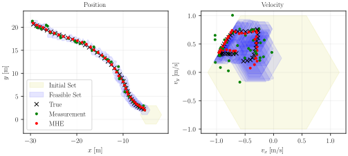

# ZonoOpt

This C++ library provides classes and tailored optimization routines for zonotopes, constrained zonotopes, and hybrid zonotopes. All classes and methods are implemented using sparse linear algebra via the Eigen library. Generators may optionally have range [0,1] instead of [-1,1]. 

Python bindings can be installed from PyPI with `pip install zonoopt`. To build the bindings from source, use `pip install .`. Note that a C++ compiler is required to build from source.

This library can be used in CMake projects either via add_subdirectory or by installing the library. Including the library via add_subdirectory is recommended when possible as it permits more aggressive CPU optimizations (i.e., -march=native). To link your application to ZonoOpt, use `target_link_libraries(your_application PRIVATE ZonoOpt)`. When building the library for installation, you must set the option ZONOOPT_INSTALL to ON, i.e., `cmake -DZONOOPT_INSTALL=ON -S . -B build`. 

More information about ZonoOpt can be found in the the following publication. Please cite this if you publish work based on ZonoOpt: 
**Robbins, J.A., Siefert, J.A., and Pangborn, H.C., "Sparsity-Promoting Reachability Analysis and Optimization of Constrained Zonotopes," 2025. [https://arxiv.org/abs/2504.03885](https://doi.org/10.48550/arXiv.2504.03885).**

Python examples are located in examples, and a C++ example is located in test.

Auto-generated API documentation is available below.

[C++ API](https://psu-PAC-Lab.github.io/ZonoOpt/C++/html/index.html)

[Python API](https://psu-PAC-Lab.github.io/ZonoOpt/python/build/html/index.html)

